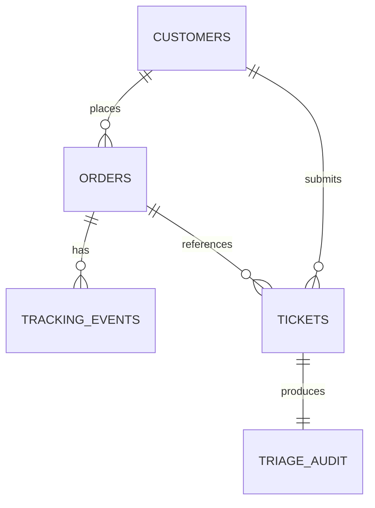

# Database & System Design: Dhaga & Co. CX Copilot & Auto-Triage MVP
**Document:** Technical Specification & Database Design  
**Stakeholder Target:** Arpita (Head of CX) & Dev (CTO)  
**Host Framework:** Streamlit (Custom Enterprise Theme)  
**Status:** Draft for Review  

---

## 1. System Overview & User Personas

To build an MVP that passes the Dhaga & Co. evaluation, the system must serve two distinct user groups and simulate the end customer:

### Persona A: The Frontline CX Agent (Primary Operator)
* **Who they are:** 34 support agents on Freshdesk handling ~9,000 tickets/week.
* **Their pain point today:** Spending 9 hours average first response time manually switching between Freshdesk, Unicommerce, and courier portals (Delhivery, Ekart, Shiprocket), copy-pasting the same 4 canned replies.
* **What they need in this tool:**
  * Zero narration needed: An intuitive, fast ticket triage workbench.
  * Instant auto-classification of tickets (WISMO, Returns, Refunds, Escalations).
  * High-confidence WISMO tickets automatically answered and archived.
  * Complex/risky tickets pre-populated with customer order history and an AI-drafted reply, needing only **1-Click Approve, Edit, or Escalate**.

### Persona B: Arpita (Head of CX) & CX Leads (Supervisors)
* **What they need:**
  * Real-time operational command center: Deflection rate %, First Response Time (FRT) reduction, and agent hours saved.
  * Tagging insights (e.g. structured return reasons to share with Neha in Merchandising).
  * Quality assurance & guardrail logs (viewing what the evaluator checked).

### Persona C: Dev (CTO) & Finance (The Auditor)
* **What they care about:**
  * Cost transparency: Token usage and INR cost per ticket run (target: < ₹0.05/ticket).
  * Reliability & Maintenance: Pure Python + SQLite/Postgres. Zero complex ML pipelines that break on Monday morning.
  * Fail-safe behavior: When order data is ambiguous or confidence is low, system fails visibly with an audit trail instead of hallucinating.

---

## 2. Key Operational & Business Factors Taken into Account

| Factor | Dhaga & Co. Reality (From Brief) | System Architectural Response |
| :--- | :--- | :--- |
| **Language & Phrasing** | 78% women, 64% tier-2/3, heavy Hinglish ("mera parcel kab pahuchega", "size tight ho gaya") | LLM Intent Router + Entity Extractor with few-shot Hinglish normalization prompt. |
| **Order Data Asset** | 11 million clean rows in Postgres | SQLite database mirroring Postgres `orders` and `tracking_events` for deterministic lookups. |
| **Cash on Delivery (61%)** | COD orders have high cancellation/RTO anxiety; refund requires bank/UPI collection | Strict COD workflow flag; auto-checks payment mode before suggesting refund policies. |
| **Return Policy Window** | Returns accepted within 7 days of delivery; 44% land in untagged "Other" box | Code checks `delivered_at` date mathematically. LLM extracts granular return reason (Fit, Stitching, Fabric, Wrong Item) to fix Neha's tagging blindspot. |
| **Customer Safety Gate** | Customer-facing replies must be safe to publish unread | Evaluator-Optimizer model verifies generated draft against DB ground truth before auto-dispatch. If check fails, routes to Human Agent. |
| **Two-Model Architecture** | Cost, latency, and quality split | **Model A (Fast/Cheap)**: Routing, extraction & drafting.<br>**Model B (Reasoning/Evaluator)**: Policy verification, tone checking, and dispute judgment. |

---

## 3. Database Schema Design (SQLite / Postgres Compatible)

The database models real e-commerce data from Dhaga & Co.'s Postgres cluster, courier webhooks, and Freshdesk support queues.



### Table 1: `customers`
Stores customer profile data reflecting tier-2/3 demographics.
```sql
CREATE TABLE customers (
    customer_id TEXT PRIMARY KEY,          -- e.g., 'CUST-8821'
    full_name TEXT NOT NULL,               -- e.g., 'Pooja Sharma'
    phone_number TEXT NOT NULL UNIQUE,     -- e.g., '+919876543210' (matches WhatsApp Gupshup ID)
    email TEXT,
    city TEXT NOT NULL,                    -- e.g., 'Jaipur', 'Bhopal', 'Patna'
    tier TEXT CHECK(tier IN ('Tier-1', 'Tier-2', 'Tier-3')) DEFAULT 'Tier-2',
    created_at TIMESTAMP DEFAULT CURRENT_TIMESTAMP
);
```

### Table 2: `orders`
Mirrors Dhaga's clean 11M-row Postgres order table.
```sql
CREATE TABLE orders (
    order_id TEXT PRIMARY KEY,             -- e.g., 'DH-10492'
    customer_id TEXT NOT NULL REFERENCES customers(customer_id),
    sku TEXT NOT NULL,                     -- e.g., 'W-KURTI-042'
    product_name TEXT NOT NULL,            -- e.g., 'Anarkali Cotton Kurti - Rust Orange'
    product_category TEXT NOT NULL,        -- 'Womenswear', 'Kidswear', 'Mens'
    quantity INTEGER DEFAULT 1,
    total_amount REAL NOT NULL,            -- e.g., 840.00 (Dhaga AOV)
    payment_mode TEXT CHECK(payment_mode IN ('COD', 'PREPAID')) NOT NULL,
    order_status TEXT CHECK(order_status IN (
        'PLACED', 'PROCESSING', 'SHIPPED', 'IN_TRANSIT', 
        'OUT_FOR_DELIVERY', 'DELIVERED', 'RETURN_REQUESTED', 
        'RETURNED', 'CANCELLED', 'RTO'
    )) NOT NULL,
    courier_partner TEXT CHECK(courier_partner IN ('Delhivery', 'Shiprocket', 'Ekart')),
    awb_number TEXT UNIQUE,                -- e.g., 'DEL-99281726'
    order_date TIMESTAMP NOT NULL,
    dispatched_date TIMESTAMP,
    delivered_date TIMESTAMP,              -- NULL until delivered
    expected_delivery_date DATE NOT NULL,
    delivery_address TEXT NOT NULL
);
```

### Table 3: `shipment_tracking_events`
Simulates live courier webhooks (Delhivery/Ekart) for tracking milestones.
```sql
CREATE TABLE shipment_tracking_events (
    event_id INTEGER PRIMARY KEY AUTOINCREMENT,
    order_id TEXT NOT NULL REFERENCES orders(order_id),
    awb_number TEXT NOT NULL,
    event_timestamp TIMESTAMP NOT NULL,
    hub_location TEXT NOT NULL,            -- e.g., 'Bhiwandi FC', 'Gurugram Hub', 'Patna Hub'
    event_status TEXT NOT NULL,            -- e.g., 'In Transit', 'Out for Delivery', 'Delayed - Weather'
    event_description TEXT NOT NULL
);
```

### Table 4: `support_tickets`
Represents inbound tickets from Freshdesk and WhatsApp (Gupshup).
```sql
CREATE TABLE support_tickets (
    ticket_id TEXT PRIMARY KEY,            -- e.g., 'TCK-5012'
    source TEXT CHECK(source IN ('Freshdesk', 'WhatsApp')) NOT NULL,
    customer_phone TEXT NOT NULL,
    raw_message TEXT NOT NULL,             -- Unstructured Hinglish/English message
    language_detected TEXT DEFAULT 'Hinglish',
    created_at TIMESTAMP DEFAULT CURRENT_TIMESTAMP,
    ticket_status TEXT CHECK(ticket_status IN (
        'NEW', 'AUTO_RESOLVED', 'PENDING_AGENT_REVIEW', 'AGENT_RESOLVED', 'ESCALATED'
    )) DEFAULT 'NEW'
);
```

### Table 5: `ticket_triage_audit`
The core FDE record capturing every pattern step, model execution, token cost, and policy decision.
```sql
CREATE TABLE ticket_triage_audit (
    audit_id INTEGER PRIMARY KEY AUTOINCREMENT,
    ticket_id TEXT UNIQUE NOT NULL REFERENCES support_tickets(ticket_id),
    matched_order_id TEXT REFERENCES orders(order_id), -- Extracted or matched from phone
    
    -- Step 1: Routing & Extraction (Model A)
    predicted_intent TEXT CHECK(predicted_intent IN (
        'WISMO', 'RETURN_REQUEST', 'REFUND_STATUS', 
        'DEFECT_DAMAGE', 'ESCALATION_HOSTILE', 'GENERAL_INQUIRY', 'UNKNOWN'
    )),
    sentiment TEXT CHECK(sentiment IN ('CALM', 'ANXIOUS', 'FRUSTRATED', 'ABUSIVE')),
    extracted_entities JSON,               -- e.g., {"order_id": "DH-10492", "item": "kurti"}
    router_confidence REAL,                -- 0.0 to 1.0
    
    -- Step 2: Deterministic Policy Check (Pure Code)
    deterministic_policy_check TEXT,       -- e.g., 'ELIGIBLE_FOR_AUTO_WISMO', 'RETURN_WINDOW_ACTIVE', 'ORDER_NOT_FOUND'
    order_lookup_success BOOLEAN DEFAULT 0,
    
    -- Step 3: Generation (Model A)
    generated_draft TEXT,
    
    -- Step 4: Evaluator-Optimizer Check (Model B)
    evaluator_passed BOOLEAN DEFAULT 0,
    evaluator_score REAL,                  -- 0.0 to 1.0
    evaluator_reasoning TEXT,              -- e.g., 'Truthful to EDD; empathetic tone; no hallucinated refunds.'
    
    -- Workflow Decision
    dispatch_mode TEXT CHECK(dispatch_mode IN ('AUTO_DISPATCH', 'AGENT_REVIEW', 'SUPERVISOR_ESCALATE')),
    final_response_sent TEXT,
    agent_id TEXT,                         -- NULL if auto-resolved
    agent_modified_draft BOOLEAN DEFAULT 0,
    
    -- Cost & Latency Line (For CTO Dev)
    model_router_name TEXT,
    model_evaluator_name TEXT,
    input_tokens INTEGER DEFAULT 0,
    output_tokens INTEGER DEFAULT 0,
    cost_inr REAL DEFAULT 0.0,             -- Calculated per ticket run
    execution_time_ms INTEGER DEFAULT 0,
    created_at TIMESTAMP DEFAULT CURRENT_TIMESTAMP
);
```

---

## 4. UI/UX Design Specification (Streamlit - Modern Dark Theme)

To avoid the "default plain Streamlit" feel, the app will incorporate custom CSS injection:

### Visual Language & Aesthetic Tokens
* **Background & Shell:** Deep slate navy (`#0B0F19` background, `#111827` card containers, `#1F2937` borders).
* **Accent & Highlights:**
  * Emerald (`#10B981`) for Auto-Resolved & High Confidence.
  * Amber/Orange (`#F59E0B`) for Pending Agent Review / Approvals.
  * Crimson (`#EF4444`) for Escalations, High Anger, and Intentional Failures.
  * Violet/Indigo (`#6366F1`) for AI Drafter / Evaluator badge.
* **Typography:** Clean sans-serif system stack (`Inter`, `Segoe UI`, system-ui).

### Screen Layout: The CX Command Center

#### 1. Header Banner & Live Metrics Bar (Top)
Displays the 4 key metrics Ritu and Arpita will look for:
* **Total Tickets Ingested:** e.g., `1,250 Today`
* **Auto-Resolution Rate (WISMO):** e.g., `72.4% (No human touched)`
* **Average Response Time:** `14 seconds` (down from 9 hours)
* **API Cost Line:** `₹0.028 / ticket` (Running Total: `₹35.00`)

#### 2. Main Two-Column Layout (8:12 Ratio)
* **Left Column — Ticket Queue & Inbound Feed:**
  * Filter pills: `[All]`, `[Auto-Resolved (Green)]`, `[Needs Agent Review (Amber)]`, `[Escalations (Red)]`.
  * Ticket list items showing: Customer name, city (Tier-2), Hinglish snippet preview, Intent badge, and Confidence score.
* **Right Column — Agent Copilot & Execution Inspector:**
  * **Section 1: Ticket Details & Extracted Order Card:** Shows customer details, matched order status, courier milestone, and payment mode (COD badge highlighted).
  * **Section 2: AI Execution Trace (Code vs Model Split):**
    * Step 1: Model Tagging & Confidence
    * Step 2: Deterministic Policy Lookup Result
    * Step 3: Evaluator-Optimizer verification pill (`PASSED: Ground truth verified`)
  * **Section 3: Response Action Workbench:**
    * If `AUTO_RESOLVED`: Green read-only status box with exact message delivered to WhatsApp/Freshdesk and timestamp.
    * If `PENDING_AGENT_REVIEW`: Pre-filled editable text area with AI-suggested draft, and three clear action buttons:
      * `[⚡ 1-Click Approve & Send]`
      * `[✏️ Save & Send Edits]`
      * `[🚨 Escalate to Lead]`

#### 3. Interactive Sandbox / Simulator Tab
* Mentors or reviewers can paste any custom Hinglish text, pick an order ID, and watch the pipeline run end-to-end with real-time token and latency counts.

---

## 5. Seed Dataset Plan (Realistic Dhaga & Co. Edge Cases)

The database will be pre-seeded with 15–20 high-fidelity scenarios representing the actual case study:
1. **Classic Happy-path WISMO (In Transit):** *"Mera order #DH-10492 kab tak aayega?"* $\rightarrow$ Delhivery active tracking, auto-resolves in 10s.
2. **Delayed Transit WISMO (Frustrated COD):** *"5 din ho gaye abhi tak courier nahi mila, cancel kar dunga agar kal tak nahi aaya"* $\rightarrow$ Detects delay, sends reassuring EDD + tracking link.
3. **Return Fit Issue (Neha's problem):** *"Kurti ka size bohot tight hai, mujhe XL exchange karna hai"* $\rightarrow$ Checks 7-day policy (Valid), drafts return pickup instructions, tags `Return_Reason: Fit_Small`.
4. **Return Expired (Deterministic Policy Block):** Customer requests return on order delivered 14 days ago $\rightarrow$ Pure code flags expired window (> 7 days); drafts polite policy explanation for agent review.
5. **COD Refund Confusion:** *"Delivery boy ne paise le liye par app me cancel dikha raha hai"* $\rightarrow$ High urgency, flags P1 Escalation, presents order status and assigned senior agent ticket.
6. **Intentional Failure Case (Ambiguous/Missing ID):** *"Mera parcel nahi aaya refund do"* (No order ID, phone has 2 recent orders) $\rightarrow$ Fails visibly: flags `AMBIGUOUS_ORDER_REFERENCE`, triggers clarifying prompt instead of hallucinating.

---

## 6. Review Checklist & What to Confirm Before Code Implementation

Before we create the SQLite database file and launch the Streamlit frontend, please review:
1. **Schema Check:** Does the schema capture all data fields you want to showcase during the demo?
2. **Triage Routes:** Are you happy with the 4 core intents (`WISMO`, `RETURN_REQUEST`, `REFUND_STATUS`, `ESCALATION_SAFETY`)?
3. **Model Selection:** For local execution / demo, we can use the Google Gemini API (e.g. `gemini-2.5-flash` for bulk routing/drafting and `gemini-2.5-pro` for evaluation) with graceful offline fallback mocks if an API key is not set.
4. **Intentional Failure Case:** Does the ambiguous order scenario resonate with what you want to present in the pitch?
