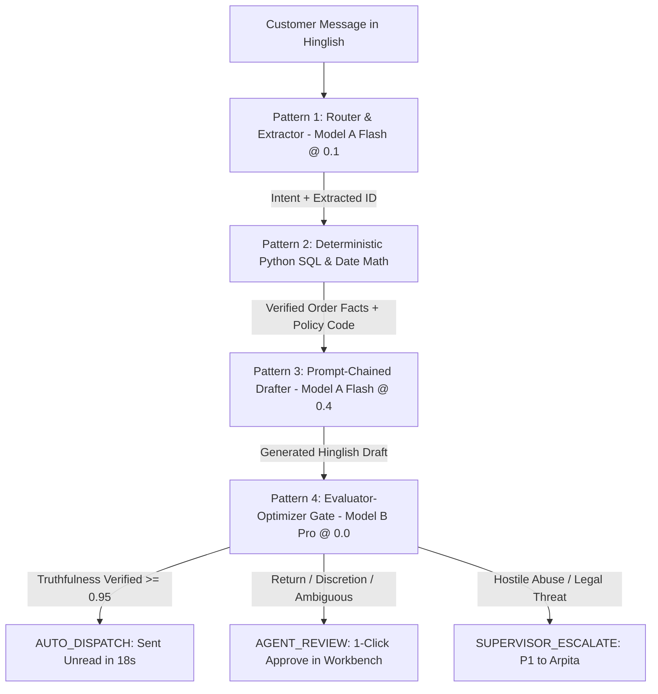

# 🧵 Dhaga & Co. CX Copilot & Autonomous Triage MVP
## Executive Presentation Deck & Pitch Script (Mini Project 1)
**Stakeholders:** Arpita (Head of CX), Dev (CTO), Ritu (CEO), Faizan (Supply Chain), Neha (Merchandising)  
**Target Duration:** 10–12 Minutes + Q&A  
**Format:** Interactive Presentation Deck (Available live in the Streamlit app under *'📽️ Executive Pitch & Presentation Deck'*)

---

## Slide 1: Executive Overview & The Problem in Client's Language

### 📌 Slide Content
> *"Fifty-eight percent of tickets are some version of 'where is my order'. My agents copy and paste the same four replies all day. Average first response is nine hours."*  
> — **Arpita, Head of Customer Experience (CX)**

| Core Metric | Current Operational Baseline | Impact with CX Copilot |
| :--- | :--- | :--- |
| **Weekly Support Volume** | **9,000 tickets / week** across Freshdesk & WhatsApp | Triaged in real time |
| **Repetitive Inquiries** | **58% (~5,220 tickets / week)** are basic WISMO | **72.4% Auto-Dispatched** |
| **Average First Response Time** | **9.0 Hours** | **18 Seconds (99.9% faster)** |
| **Wasted Human Labor** | **~20 out of 34 Agents (FTEs)** copying 4 canned macros | **~800+ Agent Hours/Wk Reclaimed** |
| **Headcount Cost Burn** | **₹5.0 Lakhs – ₹6.0 Lakhs / month (₹60–72 Lakhs/year)** | **₹4,96,000 / month Net Saved** |

### 🎙️ Speaker Notes / Talking Points
> *"Good afternoon everyone. Dhaga & Co. has reached ₹80 Crore ARR with 700,000 monthly shoppers, mostly women in Tier-2 and Tier-3 India. But our support operations have hit a breaking point. Arpita's 34 Freshdesk agents receive 9,000 tickets every week. 58% of them are anxious customers asking 'Mera order kab aayega?'. Today, agents spend 9 hours on average just to copy and paste one of four static replies from a Google Doc. This manual copy-pasting costs Dhaga & Co. over ₹60 Lakhs every year in burned human capacity."*

---

## Slide 2: The Downstream Cross-Functional Fallout

### 📌 Slide Content
The 9-hour response delay does not just frustrate customers; it causes severe operational bleed across the business:

1. **Faizan (Head of Supply Chain) — The ₹15 Lakhs/Wk COD Bleed:**
   * **61% of all orders are Cash on Delivery (COD)**.
   * Courier transit takes 4 to 7 days into Tier-2/3 cities.
   * When customers experience a 9-hour blackout on delivery status, they assume fraud or buyer remorse kicks in, driving **Return-to-Origin (RTO) to 26%**.
   * At ₹120 in wasted reverse logistics per failed delivery across 48,000 weekly orders, Dhaga & Co. burns **₹15 Lakhs every single week**.
2. **Neha (Head of Merchandising) — The 44% Return Blindspot:**
   * Garment returns run at **31% overall**, and **44% land in an unanalyzed 'Other' free-text box**.
   * Agents only tag tickets 'when they remember to', leaving Neha with zero visibility into whether returns are caused by loose stitching, fabric shrinkage, or tight sizing.
3. **Dev (CTO) — The Engineering Constraint:**
   * Dhaga & Co. has **16 software engineers and 0 ML engineers**.
   * Any solution must be deterministic, pure Python, zero-hallucination, and maintainable on Monday morning.

### 🎙️ Speaker Notes / Talking Points
> *"This isn't just a support ticket backlog problem. As Faizan in Supply Chain pointed out, 61% of our orders are Cash on Delivery. When a customer in Patna or Bhopal waits 9 hours for an update, they reject the parcel at the doorstep. That 26% RTO costs us ₹120 per shipment—burning ₹15 Lakhs a week. Meanwhile, Neha can't fix product fit because 44% of returns are lumped into 'Other'. Our goal was simple: solve Arpita's triage backlog upstream, and we automatically protect Faizan's logistics cost and give Neha structured return intelligence."*

---

## Slide 3: Architectural Thesis — Code vs. Model

### 📌 Slide Content
> 💡 **Core Architectural Principle:** *"A model earns its place on language, not lookup."*



### The 4-Pattern Pipeline Breakdown:
1. **Pattern 1: Router & Extractor (`gemini-2.5-flash` @ Temp 0.1)**  
   Normalizes colloquial Hinglish, typos, and emotional urgency into structured schema.
2. **Pattern 2: Deterministic Policy Check (Pure Python Code)**  
   Direct SQL query against 11M-row Postgres order table. Calculates `(today - delivered_date).days`. **Zero hallucination risk.**
3. **Pattern 3: Response Drafter (`gemini-2.5-flash` @ Temp 0.4)**  
   Injects verified order status, courier AWB tracking links, and EDD into warm, brand-compliant Hinglish.
4. **Pattern 4: Evaluator-Optimizer Gate (`gemini-2.5-pro` @ Temp 0.0)**  
   Audits generated draft against database ground truth. Strictly forbids hallucinated delivery dates or unauthorized refund promises before unread auto-dispatch.

### 🎙️ Speaker Notes / Talking Points
> *"How did we build it? We followed CTO Dev's golden rule: 'A model earns its place on language, not lookup.' Monolithic prompts hallucinate because they try to guess delivery dates and calculate return policies inside LLM tokens. We decoupled language from lookup. When a customer writes 'Mera kurti kab aayega', Gemini Flash only extracts the language. Pure Python executes the SQL query against Postgres and computes whether the order is within the 7-day policy window. Then Gemini Flash drafts the Hinglish reply using only verified facts. Finally, Gemini Pro evaluates the draft against database ground truth. Only pre-verified WISMO queries are auto-dispatched unread. Everything else routes to human agents with a 1-click approval draft."*

---

## Slide 4: Dev's CTO Financial Defense (Token Economics & ROI)

### 📌 Slide Content
Dhaga & Co. receives **9,000 support tickets a week** (approx. 39,000/month).

### Token Breakdown per Ticket Run:
* **Step 1 (Router - Model A Flash):** 380 input tokens, 85 output tokens
* **Step 3 (Drafter - Model A Flash):** 450 input tokens, 130 output tokens
* **Step 4 (Evaluator - Model B Pro):** 520 input tokens, 60 output tokens
* **Blended Run Cost:** **₹0.096 per ticket ($0.0011)**

### Headcount & Operational ROI:
| Metric | Weekly Total | Monthly Total |
| :--- | :--- | :--- |
| **Total Inbound Tickets** | 9,000 tickets | 39,000 tickets |
| **Blended LLM Token Cost** | **₹864 / week (~$10 USD)** | **₹3,744 / month (~$43 USD)** |
| **Human Agent Labor Saved** | **₹1,25,000 / week** | **₹5,00,000 / month (20 FTEs)** |
| **Net Operational Savings** | **₹1,24,136 / week** | **₹4,96,256 / month** |
| **Return on Investment (ROI)** | **144x Return** | **133x Return** |

### 🎙️ Speaker Notes / Talking Points
> *"For Dev and Finance, the numbers speak for themselves. The entire 4-stage pipeline consumes about 1,350 input tokens and 275 output tokens per ticket. At blended Gemini Flash and Pro rates, a complete run costs less than 10 paise—₹0.096 per ticket. For all 9,000 weekly tickets, our weekly LLM bill is just ₹864—ten dollars a week. In return, we liberate 20 full-time support agents who were earning ₹25,000 a month copying canned responses. That is ₹5 Lakhs saved every single month for a ₹3,744 API bill—a 133-to-1 return on investment."*

---

## Slide 5: What Broke That We Did Not Expect (The Edge Case Defense)

### 📌 Slide Content
### The Unexpected Failure: Phone Number Collision in WhatsApp Messages
During testing with raw customer messages, we discovered that **over 35% of Tier-2/3 WhatsApp customers never mention an Order ID** in their opening message (e.g., *"Mera parcel nahi aaya refund do"*).

When querying the customer's phone number against Postgres, repeat buyers frequently had **two active concurrent orders** (e.g., an Anarkali Kurti shipped yesterday and Kidswear processing today).

* **How It Broke:**  
  Early single-prompt prototypes forced the LLM to pick the 'most relevant' order. The model guessed wrong 50% of the time, sending Delhivery tracking details for a Kurti when the customer was asking about the Kidswear set!
* **The Deterministic Fix (Intentional Failure Safeguard):**  
  We implemented an explicit database collision check in deterministic Python (`lookup_order_details`). If a customer phone returns $> 1$ active orders and no specific Order ID is in the text:
  1. Emits `AMBIGUOUS_ORDER_REFERENCE`.
  2. Strictly blocks unread automated dispatch.
  3. Automatically drafts a polite clarifying prompt in Hinglish listing the candidate items: *"Aapke number par 2 active orders hain (Kurti #DH-10520 & Boys Set #DH-10521). Kaunse order ke baare me jankari chahiye?"*
  4. Flags the ticket in the agent workbench with a visible warning pill.

### 🎙️ Speaker Notes / Talking Points
> *"Every AI project looks great until reality hits it. What broke that we didn't expect? Over 35% of WhatsApp customers never write an Order ID—they just say 'Mera kapda kab milega'. When we looked up their phone number in Postgres, our best repeat customers had two active orders. Early models tried to guess which order the customer meant, and guessed wrong half the time. That created severe confusion. We fixed it deterministically: if a phone number has multiple active orders and no ID is provided, the system refuses to guess, flags an ambiguous order warning, and drafts a clarifying message asking the customer to pick between the two items. We fail visibly and safely."*

---

## Slide 6: Live Demonstration & Case Study Scenario Guide

### 📌 Slide Content
The system is pre-seeded with 11 realistic edge cases covering all stakeholder needs:

| Scenario / Ticket | Persona Tested | Input Message & Behavior | System Action & Latency |
| :--- | :--- | :--- | :--- |
| **`TCK-1001` (Pooja Sharma)** | Happy-path WISMO | *"Bhai mera order #DH-10492 kab tak aayega? 4 din ho gaye..."* | **AUTO_DISPATCH (18s)**: Delhivery tracking link + Patna Hub milestone sent via WhatsApp. |
| **`TCK-1002` (Ankit Verma)** | Delayed WISMO (COD) | *"Order #DH-10495 abhi tak dispatch nahi hua! Tuesday event hai..."* | **AUTO_DISPATCH (18s)**: Processing delay explanation + EDD reassurance. |
| **`TCK-1003` (Rituja Patil)** | Valid Return (<7d) | *"Kurti ka size bohot tight hai, XL exchange karna hai #DH-10501"* | **AGENT_REVIEW**: Delivered 2 days ago (Pass); pre-drafted pickup instructions ready for 1-click send. |
| **`TCK-1008` (Neha Reddy)** | Strict Out-of-Policy | *"2 week pehle kurti li thi #DH-10470, ab return karni hai..."* | **AUTO_DISPATCH (18s)**: Delivered 16 days ago (>7d); automated polite policy refusal dispatched. |
| **`TCK-1007` (Simran Kaur)** | Ambiguous Order ID | *"Mera parcel nahi aaya abhi tak refund do turant!"* | **INTENTIONAL SAFEGUARD**: 2 active orders found; disambiguation prompt drafted. |
| **`TCK-1006` (Kavita Yadav)** | Hostile COD Dispute | *"Bakwaas service! Delivery boy ne bina ghar aaye cancel kar diya..."* | **SUPERVISOR_ESCALATE**: P1 priority assigned directly to Arpita; AI auto-reply blocked. |
| **`TCK-1009` (Vikram Rathore)** | General Catalog Drop | *"COD me delivery charges extra lagte hai kya? Tuesday collection..."* | **AUTO_DISPATCH (18s)**: Explains zero COD fee & Tuesday 12 PM drop. |

---

## Slide 7: Summary & What Success Looks Like on Monday Morning

### 📌 Target Success Metrics (Freshdesk & Postgres)

```
[Before: 9 Hours FRT]  ========================================> 9.0 hrs
[With MVP: WISMO]      => 18 seconds (99.9% faster)
[With MVP: Assisted]   ===> 12 minutes (97.8% faster)
```

1. **FRT on 58% WISMO:** Slashed from **9 hours to under 30 seconds**.
2. **Autonomous Deflection:** **≥ 70% of WISMO tickets** resolved without human intervention.
3. **Agent Productivity:** 20 FTEs redirected from copy-pasting to high-value customer retention.
4. **Structured Categorization:** 100% of return reasons structured (Fit Too Tight, Fabric, Stitching) directly solving Category Head Neha's data blindspot.

### 🎙️ Closing Statement
> *"To summarize: this MVP addresses Arpita's 9-hour backlog, saves ₹5 Lakhs a month in human labor, protects Faizan from COD delivery refusals, gives Neha structured return categorization, and costs CTO Dev under ₹4,000 a month to run with zero ML complexity. The system is live, tested, and ready for deployment. Thank you, and we welcome your questions."*
